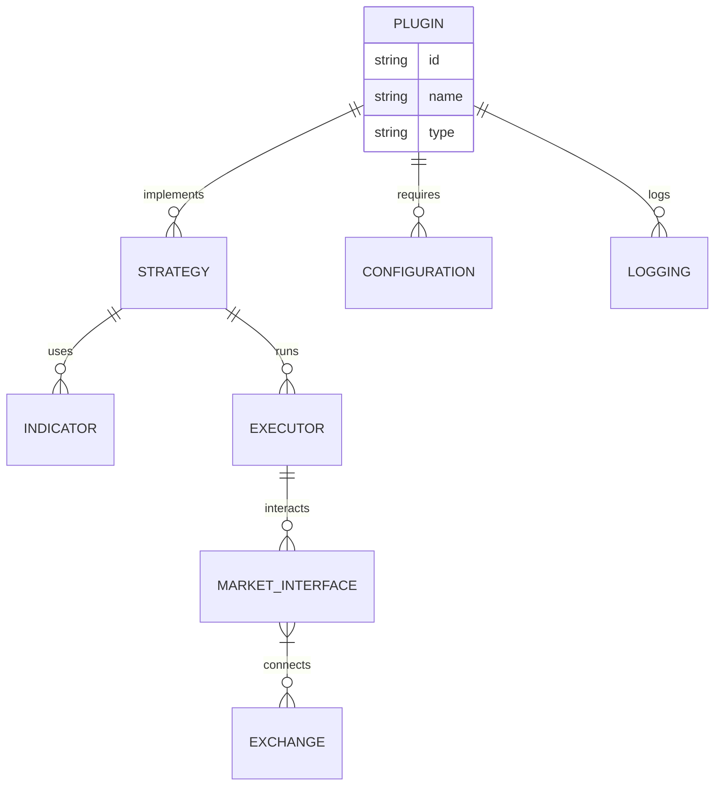

[](https://x.com/StockSharp_finance)
[](https://discord.com/invite/xPHTuHCmuV)
[](https://vscode.dev/redirect?url=vscode://ms-vscode-remote.remote-containers/cloneInVolume?url=https://github.com/StockSharp-finance/StockSharp)
<a href="https://codespaces.new/StockSharp-finance/StockSharp">
  
</a>
<a target="_blank" href="https://colab.research.google.com/github/StockSharp-finance/StockSharp/blob/develop/examples/googleColab.ipynb">
  
</a>


## Why StockSharp Plugins?
**StockSharp** (shortly **S#**) – are **free** platform for trading at any markets of the world (crypto exchanges, American, European, Asian, Russian, stocks, futures, options, Bitcoins, forex, etc.). You will be able to trade manually or automated trading (algorithmic trading robots, conventional or HFT).
**Available connections**: Binance, MT4, MT5, FIX/FAST, PolygonIO, Trading Technologies, Alpaca Markets, BarChart, CQG, E*Trade, IQFeed, InteractiveBrokers, LMAX, MatLab, Oanda, FXCM, Rithmic, cTrader, DXtrade, BitStamp, Bitfinex, Coinbase, Kraken, Poloniex, GDAX, Bittrex, Bithumb, OKX, Coincheck, CEX.IO, BitMEX, YoBit, Livecoin, EXMO, Deribit, HTX, KuCoin, QuantFEED and many other.

<a>
  <div align="center">
  
  </div>
</a>


They are:
- 🔌 Modular & reusable components
- 📦 Environment-agnostic (backtest, sandbox, live)
- 🧩 Easy to plug into any strategy or workflow
- 🌐 Exchange-agnostic with unified interfaces

Create, share, or combine plugins for indicators, strategies, risk controls, and more — all while keeping your code clean and scalable.


Designer - free universal algorithmic strategies application for easy strategy creation:

Visual designer to create strategies by mouse clicking
Embedded C# editor
Easy to create own indicators
Build in debugger
Connections to the multiple electronic boards and brokers
All world platforms
Schema sharing with own team

## StockSharp Workspace

While the StockSharp Platform is all about an integration to dozens of different data vendors, the interface is either Python or a CLI.

If you want an enterprise UI to visualize this datasets and use AI agents on top, you can find StockSharp Workspace at.


### 架构设计
**Hydra** - **free** software to automatically load and store market data:
  - Supports many sources
  - High compression ratio
  - Any data type
  - Program access to stored data via API
  - Export to csv, excel, xml or database
  - Import from csv
  - Scheduled tasks
  - Auto-sync over the Internet between several running programs S#.Data


```python
import StockSharp
"""
This example shows how backtest over tweets
"""

class TwitterBot(StockSharp.Model):
    def main(self, args):
        while self.has_data:
            self.backtester.value_account()
            self.sleep('1h')

    def event(self, type_: str, data: str):
        # Now check if it's a tweet about Tesla
        if 'tsla' in data.lower() or 'gme' in data.lower():
            # Buy, sell or evaluate your portfolio
            pass


if __name__ == "__main__":
    exchange = StockSharp.Alpaca()
    model = TwitterBot(exchange)

    # Add the tweets json here
    model.backtester.add_custom_events(StockSharp.data.JsonEventReader('./tweets.json'))
    # Now add some underlying prices at 1 month
    model.backtester.add_prices('TSLA', '1h', start_date='3/20/22', stop_date='4/15/22')

    # Backtest or run live
    print(model.backtest(args=None, initial_values={'USD': 10000}))

```

**Shell** - the ready-made graphical framework with the ability to quickly change to your needs and with fully open source code in C#:
  - Complete source code
  - Support for all StockSharp platform connections
  - Support for S#.Designer schemas
  - Flexible user interface
  - Strategy testing (statistics, equity, reports)
  - Save and load strategy settings
  - Launch strategies in parallel
  - Detailed information on strategy performance 
  - Launch strategies on schedule

## 🛠️ Installation

```C#
public class SimpleStrategy : Strategy
{
	[Display(Name = "CandleSeries",
		 GroupName = "Base settings")]
	public CandleSeries CandleSeries { get; set; }
	public SimpleStrategy(){}

	protected override void OnStarted()
	{
		var connector = (Connector)Connector;
		connector.WhenCandlesFinished(CandleSeries).Do(CandlesFinished).Apply(this);
		connector.SubscribeCandles(CandleSeries);
		base.OnStarted();
	}

	private void CandlesFinished(Candle candle)
	{
		if (candle.OpenPrice < candle.ClosePrice && Position <= 0)
		{
			RegisterOrder(this.BuyAtMarket(Volume + Math.Abs(Position)));
		}
		else if (candle.OpenPrice > candle.ClosePrice && Position >= 0)
		{
			RegisterOrder(this.SellAtMarket(Volume + Math.Abs(Position)));
		}
	}
}
```




<p align="center">
    
</p>

<p align="center">
  </center>
</p>

## Contributors

 wouldn't be  without you. If we are going to disrupt financial industry, every contribution counts. Thank you for being part of this journey.

<a href="https://github.com/StockSharp-finance/StockSharp/graphs/contributors">
   
</a>
